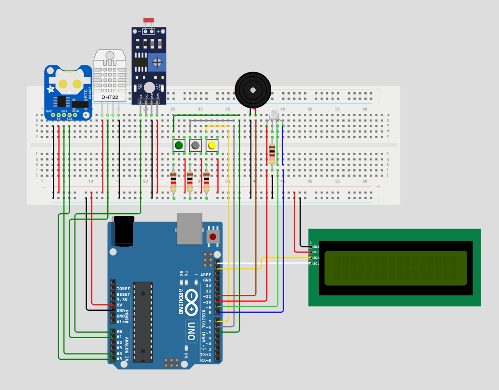
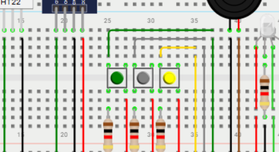
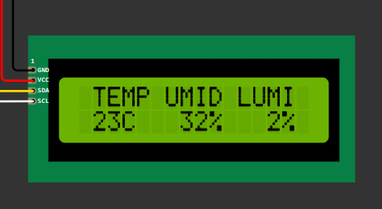
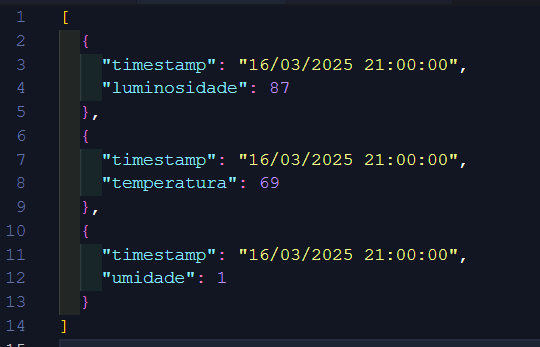
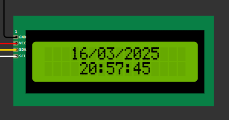
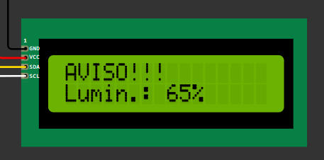

Weathuino é um sistema de monitoramento capaz de detectar e registrar condições fora do normal em um determinado ambiente. Por meio de um circuito montado com base na plataforma Arduino, o Weathuino monitora luminosidade, umidade e temperatura em tempo real, emitindo um alerta sonoro e luminoso quando algum desses parâmetros encontra-se irregular, além de registrar em uma memória não volátil o que e quando aconteceu nessas situações para posterior auditoria, que poderá ser realizada exportando os registros em um formato conveniente de JSON com apenas um clique.

# Componentes

Para a sua elaboração, foram utilizados os seguintes componentes:

- 1 MCU (Atmega 328P) - Arduino Uno R3
- 1 LDR + Resistor 10KOhm
- 1 DHT-11 (Sensor de temperatura e umidade)
- 1 LCD 16x2 - I2C
- 1 Bateria de 9V + suporte para bateria
- 1 RTC (Real Time Clock)
- 1 Buzzer
- 3 Push Buttons + 3 resistores de 1kOhm
- 1 LED RGB + 1 resistor de 1kOhm
- 3 Resistores de 1kOhm

Para montar as conexões entre os componentes utilizou-se jumpers e uma protoboard, conforme o print abaixo:

# Diagrama Elétrico

Para visualizar mais detalhes quanto à esquematização elétrica do Weathuino utilizando os componentes acima, visualize o [diagrama elétrico](docs/assets/esquema-eletrico.pdf).

# Demonstração (Vídeo Pitch)

[Por meio desde vídeo](https://www.youtube.com/watch?v=QCMW-sVKlAM), é possível compreender o funcionamento da aplicação no simulador WOKWI. Nessa plataforma, onde se pode simular vários de tipos de ambiente, visualiza-se as funcionalides disponíveis no sistema e como ele se comporta em um cenário dentro do esperado ou com algum tipo de anormalidade.

# Circuito simulado no WOKWI

Para atestar o funcionamento do Weathuino na prática, é possível acessar o [link do simulador Wokwi](https://wokwi.com/projects/425591438633036801) mostrado no vídeo.

# Parâmetros de monitoramento do Weathuino

Como dito anteriormente, o Weathuino monitora em tempo real o ambiente no qual ele está inserido, alertando quando temperatura, luminosidade e umidade estão fora do normal. Para que o sistema pudesse identificar esses cenários, foram definidos limites mínimos e máximos para estes parâmetros monitorados. Conforme o levantamento dessas propriedades, constatou-se a necessidade de utilizar um conjunto de valores diferentes para o uso *físico* e para o uso *simulado* no Wokwi. Com base nisso, para que o Weathuino indique que um ambiente está dentro da normalidade, os parâmetros medidos devem estar dentro das seguintes faixas:

### Em um cenário real (no laboratório)

| Temperatura (°C) | Luminosidade (%) | Umidade (%) |
| ------------------- | ------------------ | ------------- |
| 15 a 25           | 0 a 50           | 30 a 75     |

### Em um cenário simulado

| Temperatura (°C) | Luminosidade (%) | Umidade (%) |
| ------------------- | ------------------ | ------------- |
| 15 a 25           | 0 a 30           | 30 a 50     |

# Como Operar

Uma vez montado e ligado, o sistema primeiro exibirá a splashscreen durante a sua inicialização e, caso o ambiente esteja dentro da normalidade, já exibirá a tela principal, onde se visualiza os parâmeros monitorados em tempo real, com um LED em verde indicando que está tudo Ok. Por meio dos três botões disponíveis na interface, é possível realizar as seguintes ações:

**_Botão Esquerdo_**: Acessar a tela Principal.
Ao clicar neste botão por alguns segundos, a tela principal será exibida:

**_Botão Central_**: Exportar os registros de anormalidade da EEPROM na saída Serial no formato JSON.
Ao clicar neste botão por alguns segundos, será disponibilizado via Serial um JSON no formato abaixo, em que se informa a data e hora da anormalidade (timestamp) bem como o parâmetro fora do padrão e seu respectivo valor, adotando as unidades especificadas acima (°C para temperatura e % para umidade e luminosidade):

**_Botão Direito_**: Exibir a tela de data e hora atuais.
Ao clicar neste botão por alguns segundos, a tela de data e hora será exibida:

## Sistema de emergência

Uma vez que o Weathuino detecta que o ambiente está fora da normalidade, ele emite um alerta sonoro, acende o LED na cor vermelha e bloqueia a tela do LCD para exibir uma mensagem de alerta informando qual parâmetro está não conforme, impedindo a navegação por meio dos botões. Além disso, em paralelo o sistema já registra essa ocorrência em sua memória não volátil (EEPROM) para posterior auditoria.

# Integrantes

Abaixo é possível conferir a relação de integrantes que contribuiram para o surgimento do Weathuino (Nome e RM):

| Nome             | RM        |
| ------------------ | ----------- |
| Lucas Barboza    | 081230009 |
| Felipe Lira      | 081230006 |
| Gustavo Trindade | 081230033 |
| Vitor Malvão    | 081230020 |
| Matheus Nunes    | 081230030 |
