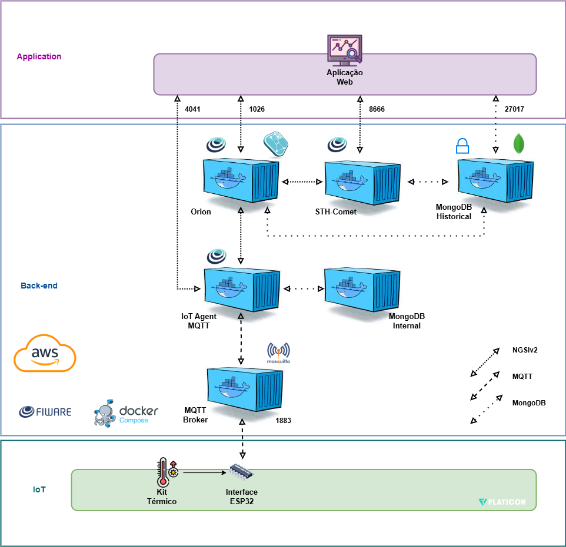

Weathuino é um sistema de monitoramento de estufas de secagem de enrolamento de motores, que apresenta a temperatura medida em gráficos para análise do comportamento de uma estufa.

# Componentes

Para a sua elaboração, foram utilizados os seguintes componentes:

- ESP32 DEVKIT Module
- Kit térmico

# Diagrama do serviço

Diagrama de funcionamento do sistema:

# Kit térmico

Clique [aqui](https://ead.cefsa.edu.br/pluginfile.php/81451/mod_resource/content/1/Artigo%20da%20Plataforma%20Did%C3%A1tica%20-%20Kits%20de%20Controle.pdf)
 para mais informações sobre o kit térmico

# Circuito simulado no WOKWI

Para atestar o funcionamento do Weathuino na prática, é possível acessar o [link do simulador Wokwi](https://wokwi.com/projects/430596388734701569) mostrado no vídeo.

# Sobre o sistema de monitoramento

O site possui funções de visualização, cadastro, edição e remoção de cadastros já feitos de usuários, estufas e sensores. Esses dados são armazenados em um banco de dados onde são gerenciados e consultados por este mesmo site. Ele também possui 2 dashboards para monitoramento em tempo de execução e para análise de dados históricos.

# Apresentação do site

Clique [aqui](https://youtu.be/QBUNj9h8Kh4) para ver o vídeo de apresentação do site

# Integrantes

Abaixo é possível conferir a relação de integrantes que contribuiram para o surgimento do Weathuino (Nome e RM):

| Nome             | RM        |
| ------------------ | ----------- |
| Lucas Barboza    | 081230009 |
| Felipe Lira      | 081230006 |
| Gustavo Trindade | 081230033 |
| Vitor Malvão    | 081230020 |
| Matheus Nunes    | 081230030 |
